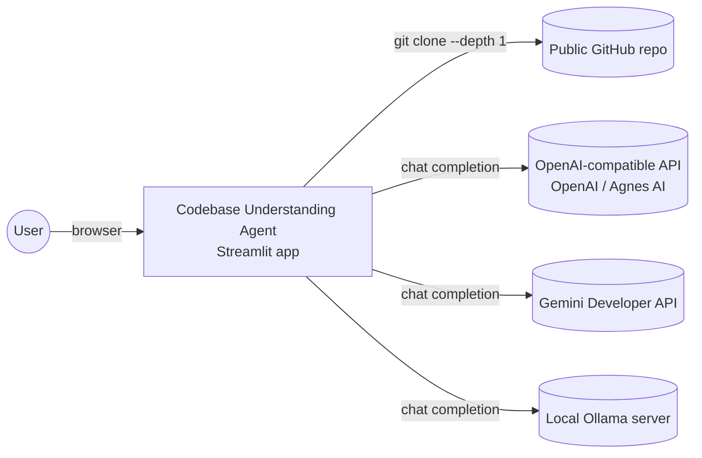
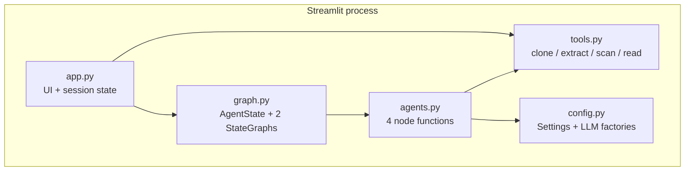
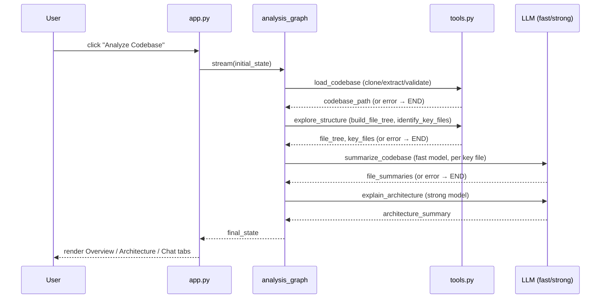
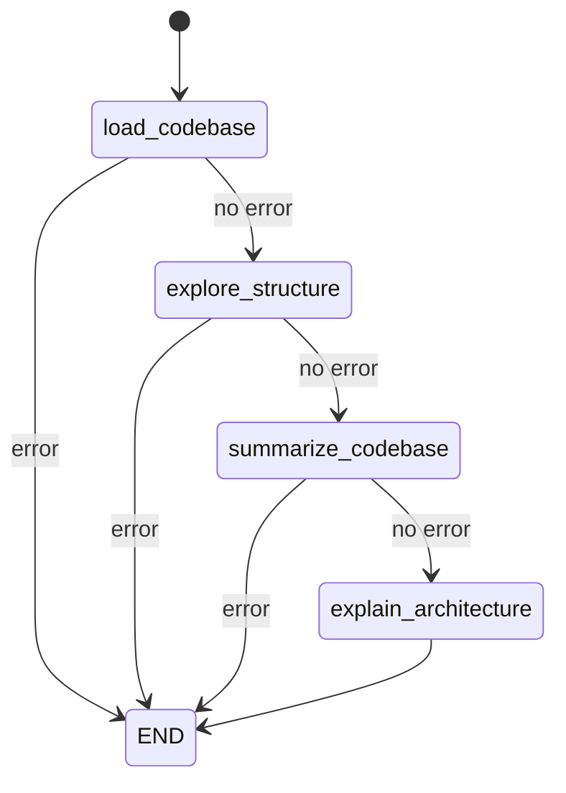

# Codebase Understanding Agent — Architecture

**Snapshot:** remote `https://github.com/pypi-ahmad/codebase-understanding-agent.git`, branch `main`, HEAD `491a1864ee78cbb7b935bbb7f51e3b918b8ae985` ("docs: add table of contents to README"). This document describes exactly that snapshot; re-verify against `git log -1` if the tree has moved on.

---

## Part 1 — Whole-repo technical deep-dive

### What this is

A single-page Streamlit app that takes a codebase (GitHub URL, local folder, or uploaded zip), runs it through a small [LangGraph](https://langchain-ai.github.io/langgraph/) pipeline of four agent nodes to build a file tree, summarize key files, and write an architecture explanation, then exposes a chat tab backed by a second one-node graph for follow-up questions (README.md:3, README.md:15-19).

### Tech-stack detection

| Layer | Technology | Evidence |
| --- | --- | --- |
| UI | Streamlit (`st.set_page_config`, tabs, chat, sidebar) | app.py:7,13,192 |
| Agent orchestration | LangGraph `StateGraph` | graph.py:8,40,61 |
| LLM client — OpenAI-compatible | `langchain_openai.ChatOpenAI` (used for OpenAI *and* Agnes AI, since Agnes exposes an OpenAI-compatible endpoint) | config.py:96,102 |
| LLM client — local | `langchain_ollama.ChatOllama` | config.py:134-140 |
| LLM client — Gemini | `langchain_google_genai.ChatGoogleGenerativeAI` | config.py:106,111 |
| Repo cloning | `GitPython` (`git.Repo.clone_from`, shallow) | tools.py:35,41 |
| Zip handling | stdlib `zipfile` | tools.py:8,73 |
| Env config | `python-dotenv` (`load_dotenv()`) | config.py:10,13 |
| Package/dependency management | `uv` (`pyproject.toml` + `uv.lock`) | pyproject.toml:1-14 |
| Language | Python ≥3.11 | pyproject.toml:4 |

### Entry points

- **UI entry point:** `app.py`, run via `streamlit run app.py` (README.md:80). No CLI, no API server — this is a single Streamlit script, not a package with a `[project.scripts]` entry (pyproject.toml has none).
- **Windows launcher:** `run.cmd` — checks for `uv` on `PATH`, runs `uv sync`, warns (but still launches) if no `OPENAI_API_KEY`/`.env` is found, then runs `streamlit run app.py --server.port 8541` (run.cmd:5-31).

### Commands & Verification Inventory

| Command | Purpose | Evidence |
| --- | --- | --- |
| `uv sync` | Install/update dependencies from `uv.lock` | run.cmd:14, README.md:74 |
| `uv run streamlit run app.py --server.port 8541` | Launch the app | run.cmd:31, README.md:80-83 |
| `run.cmd` (double-click) | One-click sync + launch on Windows | run.cmd:1-35 |

**No test command, no lint/format command, no typecheck command, and no CI workflow exist in this repository** — `pyproject.toml` declares no `[dependency-groups]`, no `[tool.ruff]`/`[tool.pytest.ini_options]` section, and `find . -iname "*.yml"` outside `.venv` returns nothing; there is no `.github/workflows` directory. `[UNVERIFIED → confirmed absent]`. Any modernization or contribution work here starts from zero test/lint infrastructure, not from a broken one.

### Directory layout

```
Codebase Understanding Agent/
├── app.py            # Streamlit UI: source input, sidebar settings, progress, tabs, chat
├── graph.py          # LangGraph AgentState + the analysis graph and Q&A graph
├── agents.py         # The 4 node functions: load, explore, summarize, explain, Q&A
├── tools.py           # Git clone, zip extraction, local path validation, file tree, file reads
├── config.py          # Settings dataclass + LLM factories (env-driven)
├── run.cmd            # Windows one-click launcher (uv sync + streamlit run)
├── .env.example        # Template for environment variables (copy to .env)
├── pyproject.toml      # Project metadata & dependencies (uv)
└── uv.lock             # Locked dependency versions
```
(README.md:47-59, confirmed against `ls` output.)

### Deployment & Runtime Surface

There is no containerization (no `Dockerfile`), no CI runner pin, no serverless config. The only runtime pins are:

| Surface | Pin | Evidence |
| --- | --- | --- |
| Python interpreter | `>=3.11` | pyproject.toml:4, uv.lock:3 |
| Streamlit port (manual run) | `8541` (README example) / `8541` (run.cmd) | README.md:80-83, run.cmd:31 |
| Ollama server (optional local LLM) | `http://localhost:11434` default, overridable | config.py:25, .env.example:3 |

No build-runtime vs. run-runtime drift is possible here because there is no separate build step — `uv sync` + `streamlit run` is both.

### EOL / dead-dependency scan

All pinned dependencies (`langchain-core`, `langchain-google-genai`, `langchain-ollama`, `langchain-openai`, `langgraph`, `gitpython`, `python-dotenv`, `streamlit`) are actively maintained libraries at the versions declared (pyproject.toml:6-13). `[INFERRED]` — no EOL or abandoned dependency identified from the manifest alone; this is not a verified upstream-changelog check.

### Data/storage, APIs, background jobs, testing

- **No persistent storage.** All analysis state lives in `st.session_state` for the duration of one browser session (app.py:15-18, README.md:159-160 "Future Improvements" already notes this as a known gap).
- **No external API surface.** The app calls out to LLM provider APIs (OpenAI-compatible, Ollama, Gemini) and to GitHub (via `git clone`) — it does not expose one.
- **No background jobs.** The analysis graph runs synchronously inside the Streamlit request (`analysis_graph.stream(...)` inside the button handler, app.py:163).
- **No automated tests exist.** Confirmed above.

---

## Part 2 — Context & ecosystem

### Identity

| Field | Value |
| --- | --- |
| Remote | `https://github.com/pypi-ahmad/codebase-understanding-agent.git` |
| Branch | `main` |
| HEAD | `491a1864ee78cbb7b935bbb7f51e3b918b8ae985` |
| Version | `0.1.0` (pyproject.toml:3) |
| License | MIT, © 2026 Ahmad Mujtaba (LICENSE:1-3) |

### Repo-specific docs

- `README.md` is the only project documentation and is comprehensive — it already covers features, tech stack, project structure, setup, env vars, usage, architecture (with a Mermaid flowchart), configuration, examples, and a "Future Improvements" list (README.md:1-171). This architecture document does not duplicate that content; it adds citation-backed depth (subsystem internals, verification inventory, ADRs) that the README intentionally keeps out for conciseness.
- No `AGENTS.md`, `CONTRIBUTING.md`, or `.github/copilot-instructions.md` exist. `.claude/scheduled_tasks.lock` is local tooling state, not project documentation.

### Developer gotchas

- **No API key set → the app still launches but every LLM call fails at invocation time**, not at startup — `run.cmd` explicitly warns but does not block (run.cmd:21-27); `config._build_openai_compatible_llm` and `_build_gemini_llm` raise `RuntimeError` only when actually invoked (config.py:98-100, 108-110).
- **Ollama detection is a live network probe on every sidebar render** — `config.list_ollama_models` hits `{base_url}/api/tags` with a 2s timeout each time the fast-provider radio is set to Ollama (config.py:78-86, app.py:55). This is a real per-rerun cost but not a bug in isolation for this project's scale.
- **Temp directories are process-wide, not session-scoped.** `TEMP_ROOT` is a single fixed path under the OS temp dir (tools.py:17), shared across all Streamlit sessions running from the same machine/user. Concurrent users on a shared deployment would each get their own `tempfile.mkdtemp` subdirectory (safe), but `cleanup_temp_dir`'s safety check only verifies the path is *somewhere* under `TEMP_ROOT` (tools.py:159-164) — it cannot distinguish "my session's clone" from "another session's clone" if a bug ever passed the wrong path. In the current single-session-per-browser-tab usage this is moot.

### Ecosystem relation

Standalone tool; no sibling repos or shared build tags visible on disk.

---

## Part 3 — Architectural blueprint

### Layering and dependency rules

```
app.py  →  graph.py  →  agents.py  →  tools.py
   ↓                         ↓
config.py  ←────────────────┘
```

- `app.py` (UI) is the only file that imports Streamlit. It never touches `tools.py` directly except for `cleanup_temp_dir` (app.py:26,240) — everything else about *how* a codebase is loaded/scored/summarized is delegated to `graph.py`/`agents.py`/`tools.py`.
- `agents.py` is the only file that imports `langchain_core.messages` and calls `.invoke()` on an LLM — it is the sole place model calls happen (agents.py:7, 64, 100, 145).
- `tools.py` depends on `config.py` only for two constants (`IGNORED_DIR_NAMES`, `KEY_FILE_PRIORITY`, tools.py:11) — it has no LangChain/LangGraph import and could be unit-tested in isolation without any LLM dependency.
- Nothing enforces this layering mechanically (no lint rule, no import-boundary check) — it is convention only, readable directly from the import statements at the top of each file.

### C4 — Level 1: System context


(README.md:14-23; config.py:96-153.)

### C4 — Level 2: Containers



### C4 — Level 3: Analysis-run lifecycle


(graph.py:39-57; agents.py:21-106; app.py:160-187.)

### Cross-cutting concerns

| Concern | Location | Evidence |
| --- | --- | --- |
| Config | `config.Settings` dataclass, built fresh from sidebar widgets every rerun | config.py:54-67, app.py:93-104 |
| Secrets | Read only from environment (`os.environ.get`), never hardcoded; `.env.example` documents the names | config.py:98,108; .env.example:1-7 |
| Error handling | Every node function catches its own exceptions and returns `{"error": ...}`; `_route_on_error` short-circuits the graph to `END` | agents.py:32-35,47-48,56-57,85-86,104-105,125-126,147-148; graph.py:35-36 |
| Logging/observability | None — no logging module, no metrics, no tracing | confirmed absent from all 5 source files |
| Feature flags | None | n/a |
| Path/filesystem safety | Zip-slip guard on extraction; cleanup refuses to delete anything outside `TEMP_ROOT`; local folders are only ever read | tools.py:73-78, 159-164; README.md:22 |

### Inferred ADRs

#### ADR: Two separate LangGraph graphs instead of one
- **Context:** the app has two distinct interaction shapes — a one-shot multi-step pipeline (analyze) and a repeated single-step interaction (chat).
- **Decision:** `build_analysis_graph()` is a 4-node linear pipeline with error short-circuiting; `build_qa_graph()` is a single `qa_agent` node, rebuilt on every chat message (graph.py:39-65, app.py:225).
- **Alternatives considered:** one graph with a conditional loop back to a Q&A node. Rejected implicitly — the two concerns have unrelated state needs (Q&A doesn't need to re-run explore/summarize) and separating them keeps each graph trivially easy to reason about.
- **Consequences:** `build_qa_graph()` is called fresh per message rather than persisted (app.py:225) — cheap here since it's a single-node graph with no compile-time cost of note, but would need revisiting if the Q&A graph ever grew nodes.

#### ADR: Fixed model presets instead of free-text model names for OpenAI/Gemini
- **Context:** users could be given a free-text field for any model string.
- **Decision:** OpenAI and Gemini are restricted to two curated presets each (`OPENAI_MODEL_OPTIONS`, `GEMINI_MODEL_OPTIONS`, config.py:16-19,32-35); Agnes AI is pinned to exactly one model (config.py:28). Only Ollama gets a live-queried, open-ended list (config.py:78-86).
- **Alternatives considered:** free-text model input for every provider.
- **Consequences:** simpler UI, fewer invalid-model-string failures, but adding a new hosted model requires a code change (config.py edit) rather than a user typing a string — acceptable trade-off for a small personal tool.

#### ADR: Cheap/expensive model split with a keyword heuristic for Q&A routing
- **Context:** every Q&A turn could always use the strong model (simple, costs more) or always the fast model (cheap, sometimes wrong for hard questions).
- **Decision:** `_choose_qa_model` routes to the strong model only if the question contains an architecture/security/performance-flavored keyword or exceeds 30 words; everything else uses the fast model (agents.py:13-18,109-115).
- **Alternatives considered:** none implemented; the code's own comment flags this explicitly as a placeholder — `# ponytail: keyword/length heuristic, not a classifier. Upgrade if misroutes start showing up in practice` (agents.py:110-111). README.md:159 lists "replace the keyword/length heuristic with a lightweight intent classifier" under Future Improvements.
- **Consequences:** zero extra LLM calls to route, but will misroute questions that need the strong model but don't match a keyword or length threshold.

### Governance & enforcement

None exist — no CODEOWNERS, no required CI checks (no CI at all), no branch protection visible from the local checkout (branch-protection status is a GitHub-side setting and cannot be confirmed from disk; `[UNVERIFIED]`).

### How to add a feature (worked example: a new LLM provider)

Based on how Gemini was added (visible as the most recent provider in the git history: commits `e51da46`/`3976e4d`/`84fae39`), the pattern for adding provider *N* is:

1. Add the SDK dependency via `uv add <package>` (pyproject.toml gains one line).
2. Add a `_build_<provider>_llm(...)` factory in `config.py` following the existing `_build_gemini_llm` shape (config.py:105-111), reading its API key from `os.environ` only.
3. Wire it into `build_strong_llm`/`build_fast_llm`'s provider dispatch (config.py:114-153).
4. Add the provider to the sidebar radio and the corresponding branch in `app.py` (app.py:34-35, 48-51).
5. Document the new env var in `.env.example` and README's Environment Variables table.

**Common pitfall:** `Settings.fast_provider`/`strong_provider` are plain strings compared with `==` in `config.py` (e.g. `if settings.strong_provider == "agnes":`, config.py:116) — a typo'd provider string silently falls through to the OpenAI branch (the `else`/final-return path in both `build_strong_llm` and `build_fast_llm`) rather than raising. A new provider must be spelled identically everywhere it's compared.

---

## Subsystem deep-dives

### 1. The analysis pipeline's error-propagation state machine (`graph.py` + `agents.py`)

Every node function returns a partial-state `dict`; LangGraph merges it into `AgentState` (a `TypedDict`, graph.py:14-32). The one field every node can set is `error: Optional[str]`. `_route_on_error` (graph.py:35-36) is the single conditional-edge function reused at all three internal branch points (graph.py:47-55) — it does not need per-edge logic because every node's contract is identical: on failure, set `error` and return early; on success, set your real output fields and leave `error` unset.

This means the four nodes (`load_codebase_node`, `explore_structure_node`, `summarize_codebase_node`, `explain_architecture_node`) are independently testable — each takes a plain `dict` and returns a plain `dict`, no LangGraph object required to unit test the logic (agents.py:21-106). The UI layer (`app.py`) adds a second, redundant error check on top by inspecting `update.get("error")` per streamed chunk (app.py:166-168) purely for the live progress display — the actual control flow (stopping the pipeline) is already handled by the graph's conditional edges, not by the UI loop.



### 2. Provider-routing fan-out in `config.py`

`build_strong_llm`/`build_fast_llm` are structurally near-identical dispatch functions (config.py:114-153), each a chain of `if settings.<x>_provider == "...":` branches ending in a default OpenAI-compatible call. The three provider families route through exactly two underlying construction paths:

- **OpenAI-compatible** (`_build_openai_compatible_llm`, config.py:89-102) — used for both OpenAI itself and Agnes AI, since Agnes exposes an OpenAI-compatible endpoint; they differ only in which env var supplies the key (`OPENAI_API_KEY` vs `AGNES_API_KEY`) and the `base_url` passed in (config.py:117-119, 122-128, 141-143, 147-152).
- **Provider-native SDK client** — Ollama (`ChatOllama`, config.py:134-140) and Gemini (`_build_gemini_llm`, config.py:105-111) each use their own LangChain integration package.

The `reasoning_effort` kwarg is only ever passed for the OpenAI branch, fixed to `"medium"` (config.py:20, 127, 152) — this is not currently configurable from the UI, unlike temperature (app.py:82-83).

### 3. Filesystem safety in `tools.py`

Three independent safety mechanisms protect the host filesystem, each narrowly scoped to one failure mode:

- **Zip-slip guard** (tools.py:73-78): before calling `zf.extractall`, every member's resolved path is checked to still be inside the destination directory; any escape raises `ToolError` and aborts *before* extraction proceeds.
- **GitHub URL allow-list** (tools.py:13-15, 24-30): a strict regex requiring the `https://github.com/<owner>/<repo>` shape rejects anything else (including `git://`, SSH URLs, or arbitrary hosts) before it ever reaches `git.Repo.clone_from`.
- **Delete-scope guard** (tools.py:155-164): `cleanup_temp_dir` resolves the target path and calls `.relative_to(TEMP_ROOT.resolve())` inside a `try/except ValueError` — any path not under the app's own temp root silently no-ops instead of deleting. This is why local folders (which are never copied into `TEMP_ROOT`) can never be touched by cleanup, by construction rather than by a special-cased `if source_type == "local"` check.

All three fail closed (raise or no-op) rather than fail open, which is the correct default for a tool whose whole job is to ingest arbitrary, potentially-untrusted third-party code trees.

---

## Confidence assessment

| Claim area | Confidence | Note |
| --- | --- | --- |
| Tech stack, entry points, file responsibilities | **High** | Every file read in full and cross-checked against README this session. |
| Commands & Verification Inventory (no CI/tests/lint exist) | **High** | Confirmed by direct filesystem search (`find`, `ls`), not inference. |
| Layering/dependency rules | **High** | Read directly from import statements. |
| ADRs | **Inferred** | Reconstructed from code shape + git log commit subjects; no design doc or PR description was available to confirm intent. |
| Governance/branch-protection status | **Unverified** | Cannot be determined from a local checkout; would require the GitHub API/UI. |
| EOL/dependency-health scan | **Inferred** | Based on package names/versions in the manifest; no upstream changelog or advisory lookup performed. |

---

## Footnotes — local file citations

- `README.md` — feature list, tech stack, project structure, usage, existing architecture summary, known future work.
- `pyproject.toml` / `uv.lock` — dependencies, Python version floor, absence of dev/test/lint tooling.
- `app.py` — Streamlit UI, sidebar settings wiring, analysis-run orchestration, tab rendering, chat loop.
- `graph.py` — `AgentState` shape, both `StateGraph` definitions, error-routing.
- `agents.py` — the four analysis nodes plus the Q&A node and its routing heuristic.
- `config.py` — `Settings` dataclass, model presets, Ollama probing, all four LLM factory functions.
- `tools.py` — cloning, zip extraction (with zip-slip guard), local path validation, file-tree building, key-file scoring, temp-dir cleanup.
- `run.cmd` — the Windows launch sequence and its dependency/API-key preflight checks.
- `.env.example` — the full set of supported environment variables.
- `LICENSE` — MIT, copyright holder and year.
- `git log -1` / `git remote -v` — snapshot identity for this document.
