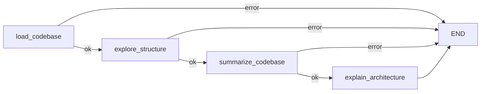

# Codebase Understanding Agent

A multi-agent Streamlit app that clones, scans, summarizes, and explains any codebase — then answers questions about it in a chat interface.


## Features

- **Three input sources** — analyze a public GitHub repository URL, a local folder path, or an uploaded `.zip` file.
- **Four specialized agents**, orchestrated as a LangGraph state graph:
  - **Explorer** (`load_codebase` + `explore_structure`) — clones/extracts/validates the source and builds a file tree, identifying key files by priority (README, manifests, entry points, configs).
  - **Summarizer** (`summarize_codebase`) — summarizes each key file with the fast model.
  - **Architecture Explainer** (`explain_architecture`) — produces a high-level architecture write-up with the strong model.
  - **Q&A Agent** (`qa_agent`) — answers follow-up questions using the file tree, summaries, and architecture summary as context, with multi-turn chat history.
- **Model routing** — cheap/fast model (OpenAI or local Ollama) for summarization and simple questions; a stronger OpenAI-compatible model for architecture explanation and harder questions (keyword/length heuristic decides which).
- **Live progress** — each agent step streams to the UI as it completes, and the pipeline stops immediately (with a clear error) if any step fails.
- **Safe temp-file handling** — GitHub clones and zip extractions land in an isolated temp directory that the app tracks and can delete on demand; local folders are only ever read, never modified or deleted.
- **One-click launch on Windows** — `run.cmd` syncs dependencies and starts the app with a double-click.

## Demo / Screenshots

_No screenshots yet — add a screenshot of the Overview/Architecture/Chat tabs here (e.g. `docs/screenshot.png`)._

## Tech Stack

| Concern | Library |
|---|---|
| UI | [Streamlit](https://streamlit.io/) |
| Agent orchestration | [LangGraph](https://langchain-ai.github.io/langgraph/) |
| LLM client (OpenAI-compatible) | `langchain-openai` (`ChatOpenAI`) |
| LLM client (local models) | `langchain-ollama` (`ChatOllama`) |
| Repo cloning | `GitPython` |
| Zip extraction | `zipfile` (stdlib) |
| Env config | `python-dotenv` |
| Package/dependency management | [`uv`](https://docs.astral.sh/uv/) |

Requires Python **3.11+**.

## Project Structure

```
Codebase Understanding Agent/
├── app.py            # Streamlit UI: source input, sidebar settings, progress, tabs, chat
├── graph.py           # LangGraph state (AgentState) + the analysis graph and Q&A graph
├── agents.py          # The 4 node functions: load, explore, summarize, explain, Q&A
├── tools.py           # Git clone, zip extraction, local path validation, file tree, file reads
├── config.py          # Settings dataclass + OpenAI/Ollama LLM factories (env-driven)
├── run.cmd            # Windows one-click launcher (uv sync + streamlit run)
├── .env.example       # Template for environment variables (copy to .env)
├── .gitignore
├── pyproject.toml     # Project metadata & dependencies (uv)
└── uv.lock            # Locked dependency versions
```

## Installation & Setup

**Prerequisites:** Python 3.11+, [`uv`](https://docs.astral.sh/uv/getting-started/installation/), and an OpenAI-compatible API key.

### Windows — one click

Double-click `run.cmd`. It runs `uv sync` to install/update dependencies, warns (but still launches) if no API key is found, and starts the app in your browser.

### Manual (any OS)

```bash
git clone <this-repo-url>
cd "Codebase Understanding Agent"
uv sync
```

Set your credentials (see [Environment Variables](#environment-variables)), then run:

```bash
uv run streamlit run app.py
```

## Environment Variables

Copy `.env.example` to `.env` and fill in your values, **or** set these as real system environment variables (system variables always take precedence over `.env`).

| Variable | Required | Default | Purpose |
|---|---|---|---|
| `OPENAI_API_KEY` | Yes | — | API key for the OpenAI-compatible endpoint. Never hardcoded; read from the environment only. |
| `OPENAI_BASE_URL` | No | provider default | Base URL for an OpenAI-compatible endpoint (e.g. a proxy or alternate provider). |
| `OPENAI_STRONG_MODEL` | No | `gpt-4o` | Model used for architecture explanation and hard questions. |
| `OPENAI_FAST_MODEL` | No | `gpt-4o-mini` | Model used for file summaries and simple questions (when the fast provider is OpenAI). |
| `OLLAMA_BASE_URL` | No | `http://localhost:11434` | Base URL of a local Ollama server, used when the fast provider is set to Ollama. |
| `OLLAMA_MODEL` | No | `llama3.2` | Ollama model name for the fast tier. |

All defaults and overrides can also be changed at runtime from the sidebar.

## Usage

1. Launch the app (`run.cmd` or `uv run streamlit run app.py`).
2. Pick a source: **GitHub URL**, **Local Folder**, or **Upload Zip**, and provide it.
3. Click **Analyze Codebase** and watch the Explorer → Summarizer → Architecture Explainer steps stream in.
4. Browse the results:
   - **Overview** tab — file tree and per-key-file summaries.
   - **Architecture** tab — the generated architecture explanation.
   - **Chat** tab — ask follow-up questions about the codebase.
5. When finished, use **Delete cloned/extracted files now** or **Clear session** in the footer to clean up (skipped automatically if "Keep cloned/extracted files after session" is checked).

## How It Works (Architecture)

The app runs two small LangGraph graphs against a shared `AgentState` (file tree, key files, summaries, architecture summary, chat history, settings, error).

**Analysis graph** — runs once per "Analyze Codebase" click, short-circuiting to `END` if any step sets an error:



- `load_codebase` clones the GitHub URL (shallow, via GitPython), validates the local path, or safely extracts the uploaded zip (guarded against zip-slip).
- `explore_structure` walks the tree (skipping `.git`, `node_modules`, `.venv`, etc.), renders a text tree, and scores files by a key-file priority list (README, `pyproject.toml`, `package.json`, `Dockerfile`, entry-point scripts, ...).
- `summarize_codebase` sends each key file's (truncated) content to the fast model for a short summary.
- `explain_architecture` sends the file tree and all summaries to the strong model for a structured architecture write-up.

**Q&A graph** — a single `qa_agent` node, invoked once per chat message with the file tree, architecture summary, file summaries, and recent chat history as context. A keyword/length heuristic (`agents._choose_qa_model`) picks the strong model for architecture/design/security/performance-flavored or long questions, and the fast model otherwise. `chat_history` uses a LangGraph reducer (`operator.add`) so each turn appends rather than overwrites.

## Configuration Options

Available in the sidebar, all backed by `config.Settings`:

- **Strong model** — OpenAI-compatible model name for architecture/hard Q&A.
- **Fast model provider** — OpenAI or Ollama.
- **Fast model name** — OpenAI model name, or Ollama model + base URL.
- **Temperature** — separate sliders for the strong and fast models.
- **Max files to summarize** — caps how many key files the Summarizer processes.
- **Keep cloned/extracted files after session** — skip automatic cleanup of temp directories.

## Examples

- Analyze `https://github.com/<owner>/<repo>`, then ask in Chat: _"What does the Summarizer agent do?"_ or _"Why was this architecture chosen?"_ (routes to the strong model due to the "why" keyword).
- Point **Local Folder** at a project on disk to get a file tree and architecture summary without cloning anything.
- Zip up a project you don't have in Git and drop it into **Upload Zip** for the same analysis.

## Future Improvements

- Parallelize per-file summarization instead of the current sequential loop.
- Replace the keyword/length Q&A routing heuristic with a lightweight intent classifier.
- Persist analysis results across sessions (currently held only in Streamlit session state).
- Add automated tests for the graph nodes and tools.

## License

No license file is currently included in this repository. Add a `LICENSE` file (e.g. MIT, Apache-2.0) before distributing this project.

## Acknowledgements

Built with [Streamlit](https://streamlit.io/), [LangGraph](https://langchain-ai.github.io/langgraph/) / [LangChain](https://www.langchain.com/), and [GitPython](https://gitpython.readthedocs.io/).
